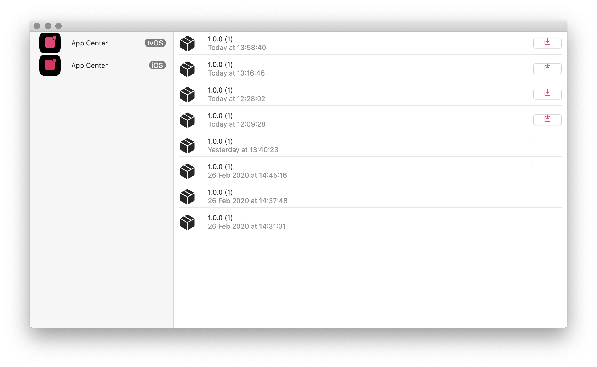
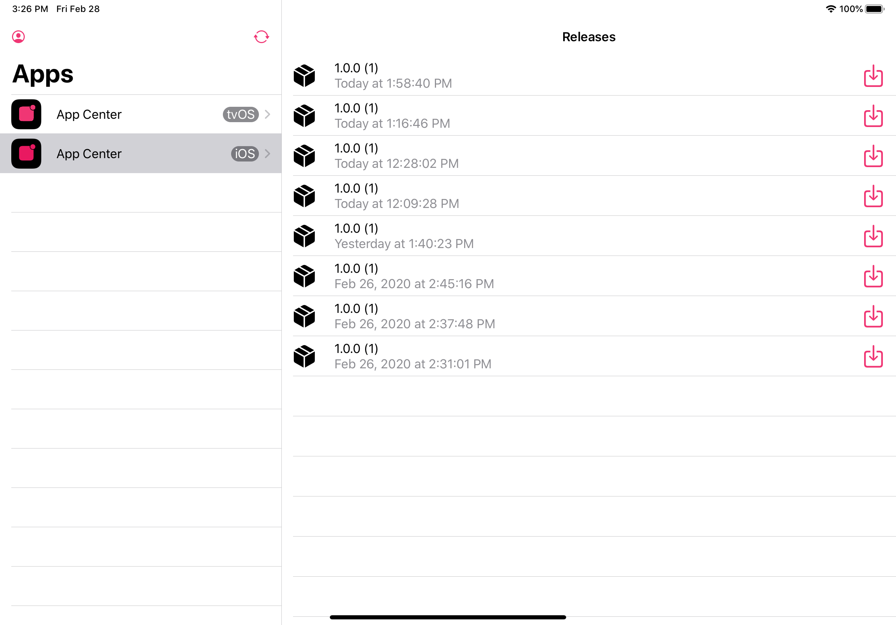

# App Center Client for iOS, macOS and tvOS in SwiftUI

Native client for [VS App Center](https://appcenter.ms) on Apple platforms. For simplying app installation for mobile QA teams and distributing internal builds.

This app was made as an experiment for learning SwiftUI and testing [my implementation of uni-directional data flow/architecture](https://github.com/mkj-is/Elementary).

## Features

- Three platforms: iOS, macOS and tvOS.
- Login using your App Center account. 
- List of apps and their releases.
- Ability to install/download those releases.

## Points of interest for a curious developer

- Architecture & functional programming
    - Uni-directional architecture using [Elementary](https://github.com/mkj-is/Elementary) framework.
    - Cross-platform core Swift package instead of a using Xcode framework target.
    - [No-op functions](AppCenterSwiftUI/Sources/AppCenterSwiftUI/Functional/NoopFunctions.swift) for providing previews with no-op functions as callbacks instead of using many braces and underlines.
    - [Lift operator](AppCenterSwiftUI/Sources/AppCenterSwiftUI/Functional/LiftOperator.swift) to simplify passing of views as closures where no auto-closure annotation is present, to remove braces count in SwiftUI. Typical use-case is `Button` and its label.
- SwiftUI
    - [WebImage](AppCenterSwiftUI/Sources/AppCenterSwiftUI/Views/WebImage.swift) cross-platform view for loading and presenting image using URLSession and Combine.
    - [System](AppCenterSwiftUI/Sources/AppCenterSwiftUI/Views/System.swift) view for using different view hierarchies based on platform.
    - [Modal](AppCenterSwiftUI/Sources/AppCenterSwiftUI/Views/Modal.swift) view encapsulating button and modal sheet into one view.
    - [ActivityIndicator](AppCenterSwiftUI/Sources/AppCenterSwiftUI/Views/ActivityIndicator.swift) adding UIViewController support to SwiftUI on iOS.
    - [View+error](AppCenterSwiftUI/Sources/AppCenterSwiftUI/Modifiers/View+Error.swift) view modifier for presentation of alert sheets if optional error is present.

## Known issues

- [ ] tvOS app does not work well just yet.
- [ ] Selecting apps in split view on iPad crashes inside SwiftUI.

## Contributing

All contributions are welcome.

Project was created by [Matěj Kašpar Jirásek](https://github.com/mkj-is).

AppCenterSwiftUI client is available under the GNU GPL v3 license. See the [LICENSE file](LICENSE.txt) for more info.
